<!-- ========================================================= -->
<!--                         HABITLY                           -->
<!-- ========================================================= -->

<div align="center">

# 🌟 HABITLY

### *Build Better Habits. Stay Consistent. Grow Every Day.*

### 🚀 AI-Powered Habit Tracking Platform built with MERN Stack + Gemini AI

<p align="center">

<a href="https://habitly-ai.vercel.app/">

</a>

<a href="LICENSE">

</a>

<a href="https://github.com/Arpit-Maddhesiya/HABITLY/stargazers">

</a>

<a href="https://github.com/Arpit-Maddhesiya/HABITLY/network/members">

</a>

<a href="https://github.com/Arpit-Maddhesiya/HABITLY/issues">

</a>

<a href="https://github.com/Arpit-Maddhesiya/HABITLY/commits/main">

</a>

</p>

<p align="center">


</p>

---

### ⭐ If you like this project, consider giving it a star!

It motivates me to build more impactful open-source projects ❤️

</div>

---

# 📑 Table of Contents

- 🌟 About Habitly
- 🚀 Live Demo
- ✨ Features
- 🤖 AI Features
- 📸 Screenshots
- 🎥 Demo
- 🛠 Tech Stack
- 🏗 Project Architecture
- 📂 Folder Structure
- 🗄 Database Design
- 🔐 Authentication Flow
- ⚡ Installation
- 🔑 Environment Variables
- 📡 API Reference
- 🚀 Deployment
- 📈 Performance
- 🔮 Future Scope
- 🤝 Contributing
- 👨‍💻 Author
- ⭐ Support

---

# 🌍 Live Demo

## 🔗 Website

https://habitly-ai.vercel.app/

---

## 👤 Demo Credentials

### Owner Account

```text
Email:
arpit@owner.com

Password:
Owner123
```

---

# 🌟 About Habitly

Habitly is an AI-powered habit tracking application that helps users stay consistent, build productive routines, and understand their habits using intelligent insights.

Unlike traditional habit trackers that simply mark tasks as completed, Habitly analyzes your habit history and provides personalized AI-generated recommendations, recovery plans, motivational messages, and weekly progress reports.

The application is designed to combine productivity with artificial intelligence, making habit building smarter, more engaging, and more sustainable.

---

# ❓ Why Habitly?

Most habit tracking applications only answer one question:

> "Did you complete today's habit?"

Habitly answers much more.

✔ Why are your habits breaking?

✔ Which day are you least productive?

✔ What habits should you start next?

✔ How can you recover from a broken streak?

✔ What patterns exist in your routine?

✔ Which category is improving the fastest?

Instead of only tracking habits,

Habitly understands them.

---


# 🚀 Key Features

| Feature | Description |
|---------|-------------|
| 🔐 JWT Authentication | Secure Login & Registration |
| 👤 User Profiles | Personalized Experience |
| ➕ Habit CRUD | Create, Update & Delete Habits |
| 📅 Daily Habit Tracking | Mark Daily Completion |
| 🔥 Streak Counter | Track Consistency |
| 📊 Analytics Dashboard | Interactive Charts |
| 🟩 GitHub-style Heatmap | Visual Activity |
| 📈 Weekly Reports | AI Generated |
| 💡 Habit Suggestions | Gemini Powered |
| 💬 AI Chat | Analyze User Habits |
| 🩹 Recovery Plans | Recover Broken Streaks |
| 🌞 Morning Motivation | Daily AI Message |
| 🌙 Theme Switch | Light & Dark Mode |
| 📱 Fully Responsive | Works Everywhere |

---

# 🤖 AI Features

Habitly integrates Google's Gemini AI to make habit tracking intelligent rather than passive.

### 🌞 Morning Motivation

### 📊 Weekly AI Report

### 🩹 Recovery Plan

### 💡 Habit Suggestions

### 💬 AI Chat

Chat with your own productivity data.

Examples:

```
Why am I missing workouts?

Which habit is improving the most?

What should I focus on next week?

Which day am I least productive?

How can I increase my streak?
```

---


<!-- ========================================================= -->
<!--                  SCREENSHOTS & SHOWCASE                   -->
<!-- ========================================================= -->


# 🖼 Screenshots

## 🌐 Landing Page

<div align="center">

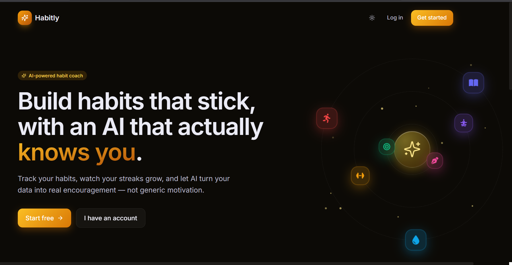

</div>


---

## 🔐 Authentication

<table>

<tr>

<td width="50%">

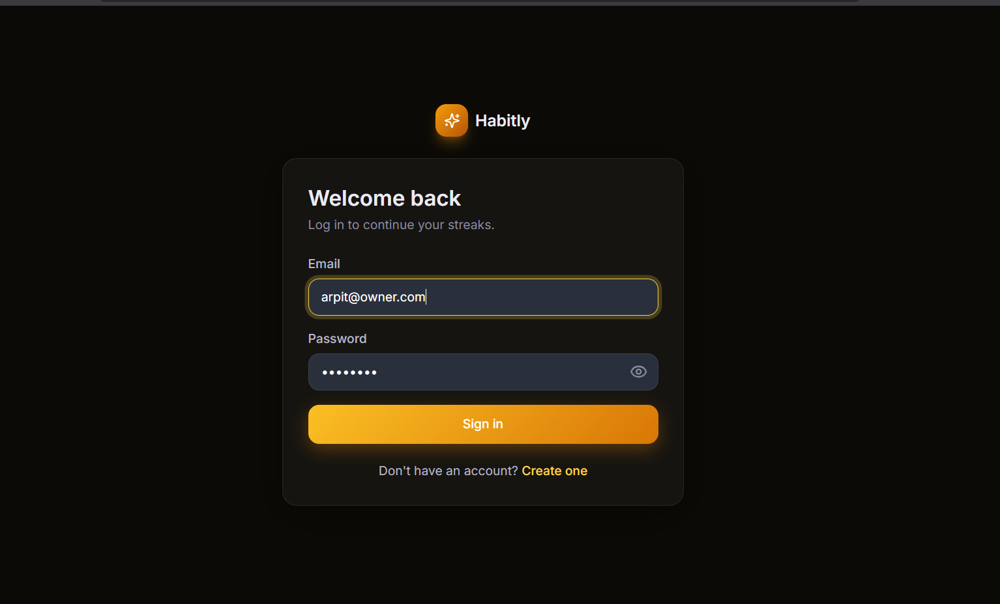

<h3 align="center">Login</h3>

</td>

<td width="50%">

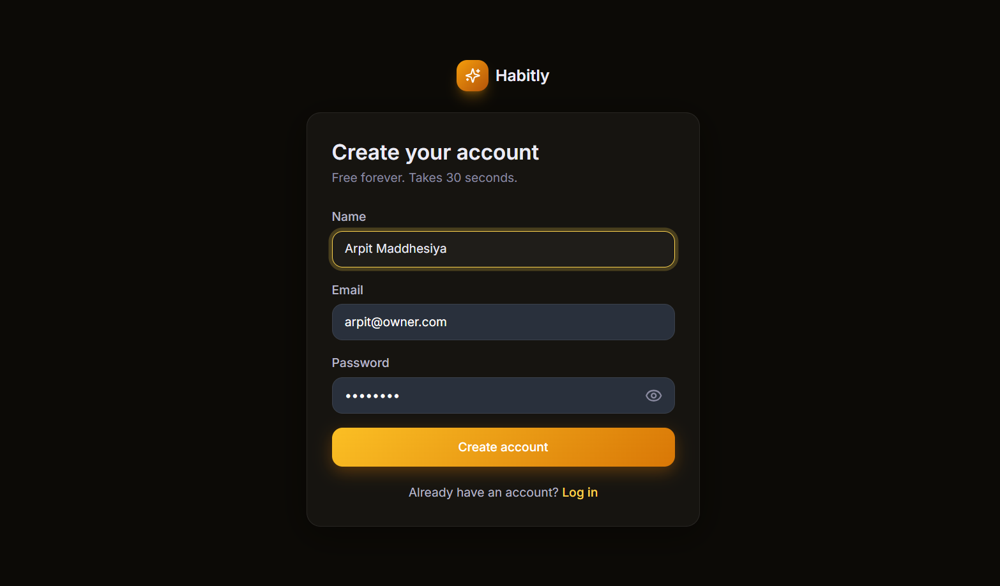

<h3 align="center">Registration</h3>

</td>

</tr>

</table>

---

# 🏠 Dashboard

<div align="center">

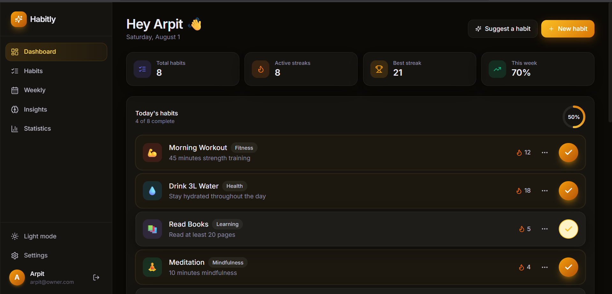

</div>

---

# 📅 Weekly Overview

<div align="center">

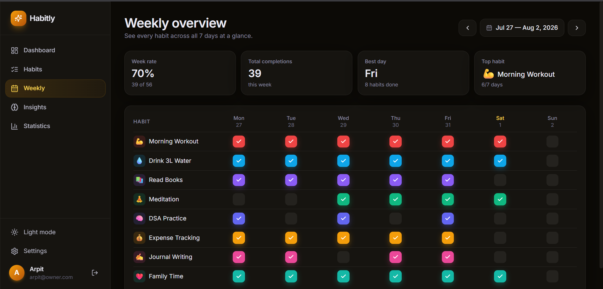

</div>

---

# 📈 Statistics Dashboard

<div align="center">

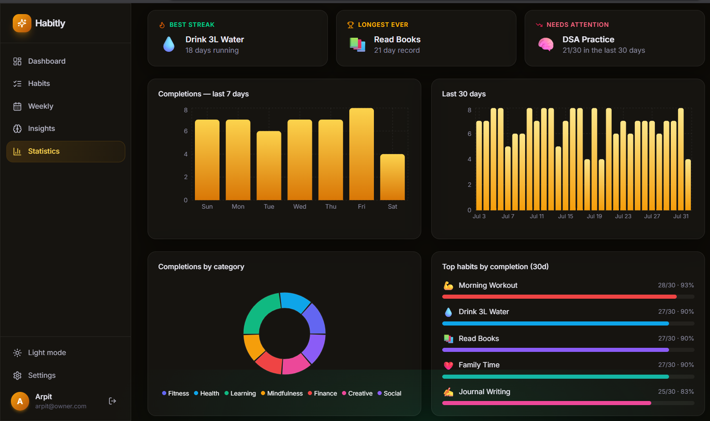

</div>

---

# 🟩 GitHub Style Heatmap

<div align="center">

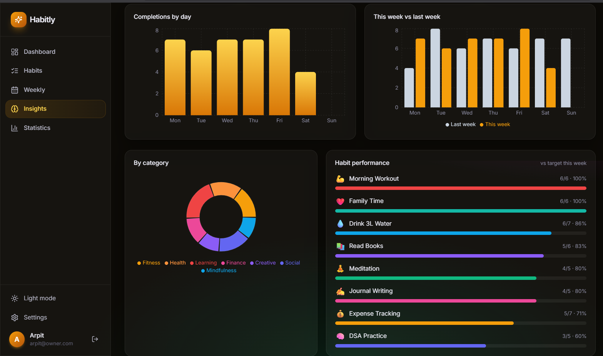

</div>

---

# 🤖 AI Weekly Report

<div align="center">


</div>

---

# 💡 AI Habit Suggestions

<div align="center">

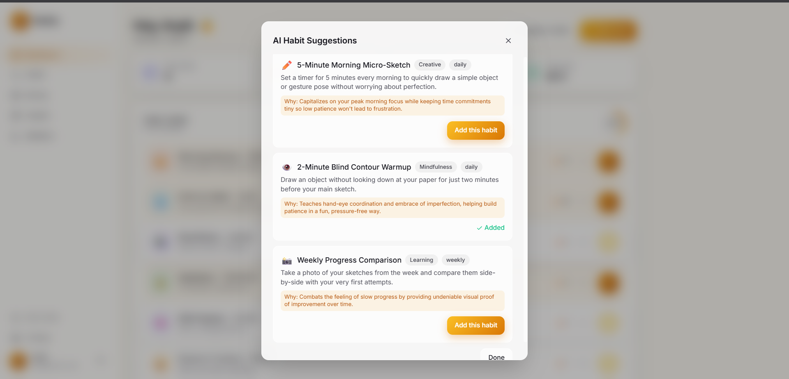

</div>

Simply tell Habitly your goal

Example

```
I want to become healthier.

I want to wake up early.

I want to learn DSA.

I want to read books.
```

Gemini instantly recommends habits specifically designed for those goals.

---

# 💬 AI Productivity Chat

<div align="center">

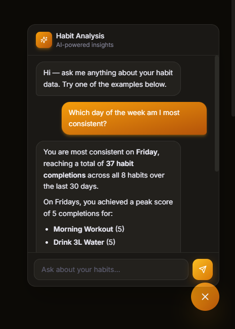

</div>

Chat with your own productivity history.

Example questions

```
Why am I missing workouts?

Which habit is improving the fastest?

How productive was I this month?

Suggest improvements.
```

---

# 🌙 Dark Theme

<table>

<tr>

<td width="50%">

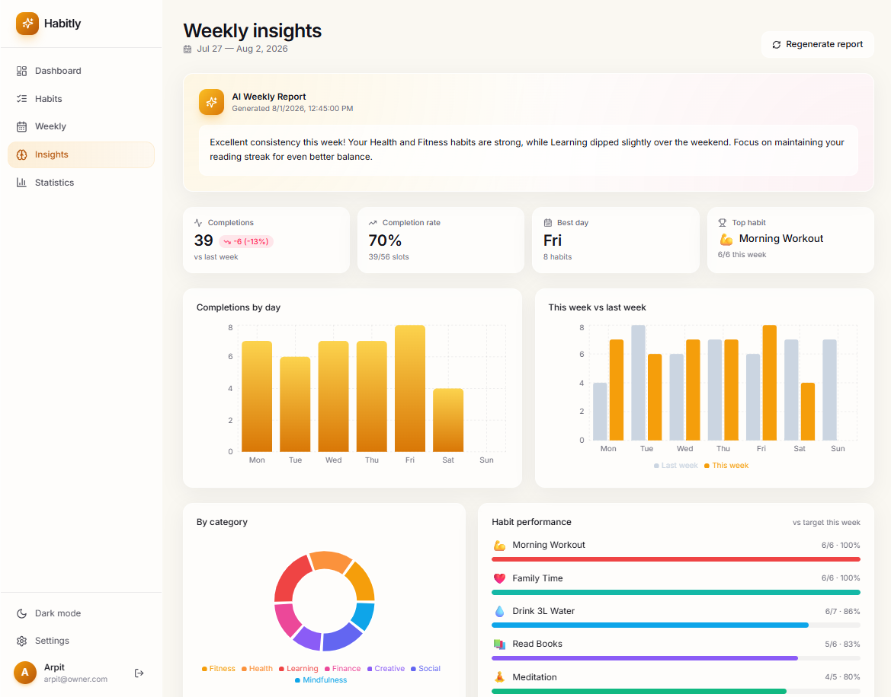

<h3 align="center">Light Theme</h3>

</td>

<td width="50%">


<h3 align="center">Dark Theme</h3>

</td>

</tr>

</table>


---


<!-- ========================================================= -->
<!--                  ARCHITECTURE & DESIGN                    -->
<!-- ========================================================= -->

# 🏗 System Architecture

Habitly follows a modern **three-tier architecture** with a React frontend, Express backend, MongoDB database, and Gemini AI integration.

---

## High-Level Architecture

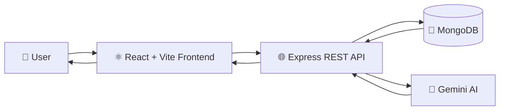

---
# 🗄 Database Design

Habitly stores data in MongoDB using four primary collections.

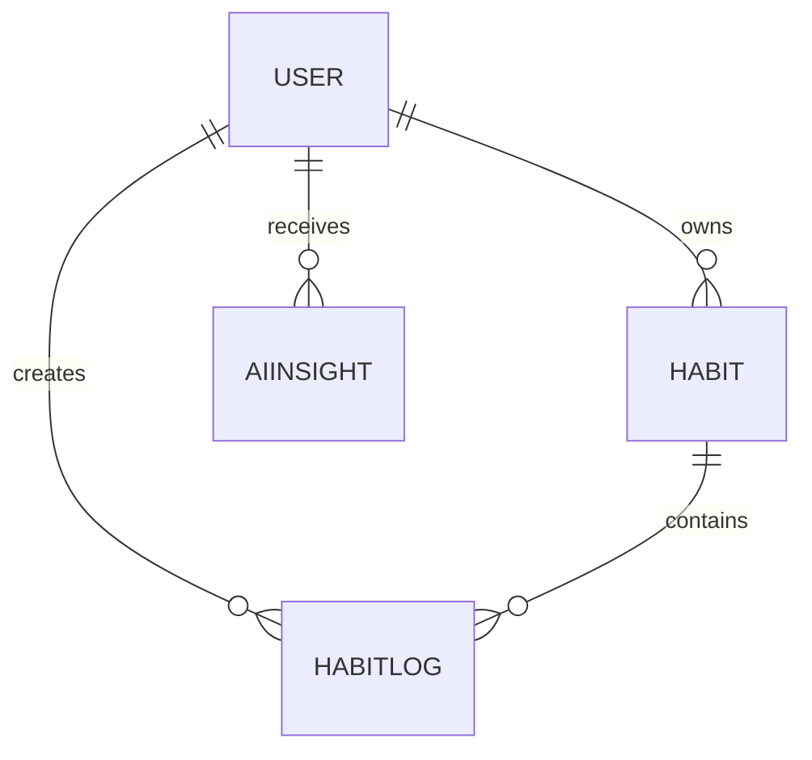

---


# 🔐 Authentication Flow

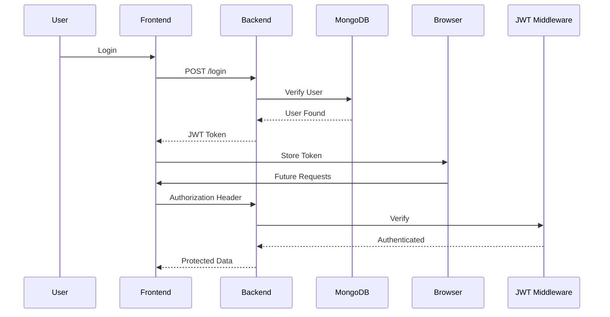

---


# 📦 API Architecture

```text
/api
│
├── auth
│     ├── register
│     ├── login
│     ├── me
│     └── profile
│
├── habits
│     ├── create
│     ├── update
│     ├── delete
│     ├── archive
│     └── reorder
│
├── logs
│     ├── today
│     ├── range
│     ├── stats
│     ├── heatmap
│     └── completion
│
└── ai
      ├── weekly-report
      ├── suggest-habits
      ├── recovery-plan
      ├── morning
      └── chat
```

---

# ⚡ Technology Stack

| Layer | Technologies |
|--------|--------------|
| Frontend | React 19, Vite, Tailwind CSS |
| Backend | Node.js, Express.js |
| Database | MongoDB, Mongoose |
| Authentication | JWT |
| AI | Google Gemini |
| Charts | Recharts |
| HTTP Client | Axios |
| Icons | Lucide React |
| Deployment | Vercel + Render (or your backend host) |

---

# 🔒 Security Features

- JWT Authentication
- Password Hashing
- Protected Routes
- Authorization Middleware
- Secure Environment Variables
- MongoDB Validation
- CORS Configuration
- Input Validation
- Error Handling
- Token-Based API Access

---

# 📈 Scalability Highlights

- Modular folder structure
- RESTful API design
- Reusable React components
- Centralized API client
- AI service abstraction
- Separate controller/model layers
- Extensible AI prompt system
- Database indexing for habit logs
- Environment-based configuration

---

<div align="center">

# 🏛 Built Using Modern Software Engineering Principles

### Modular • Scalable • Maintainable • AI-Driven

</div>

<!-- ========================================================= -->
<!--            INSTALLATION • DEPLOYMENT • API                -->
<!-- ========================================================= -->

# ⚡ Getting Started

Get Habitly running locally in just a few minutes.

---

# 📋 Prerequisites

Before you begin, make sure you have the following installed:

| Software | Version |
|-----------|----------|
| Node.js | 18+ |
| npm | 9+ |
| MongoDB | Local or Atlas |
| Git | Latest |
| Gemini API Key | Optional |

---

# 📥 Clone Repository

```bash
git clone https://github.com/Arpit-Maddhesiya/HABITLY.git
cd HABITLY
```

---

# 📂 Project Structure

```
HABITLY/
├── backend/
├── frontend/
├── docs/
├── README.md
└── LICENSE
```

---

# 🚀 Backend Setup

Navigate to backend

```bash
cd backend
```

Install dependencies

```bash
npm install
```

---

## Backend Environment Variables

Create

```
backend/.env
```

```env
PORT=8000
MONGO_URI=your_mongodb_connection_string
JWT_SECRET=your_secret_key
CLIENT_URL=http://localhost:5173
GEMINI_API_KEY=your_gemini_api_key
GEMINI_MODEL=models/gemini-2.5-flash
```

---

## Start Backend

```bash
npm run dev
```

Server starts on

```
http://localhost:8000
```

---

# 💻 Frontend Setup

Navigate

```bash
cd frontend/habit-tracker
```

Install packages

```bash
npm install
```

---

## Frontend Environment Variables

Create

```
frontend/habit-tracker/.env
```

```env
VITE_API_URL=http://localhost:8000/api
```

---

## Start Frontend

```bash
npm run dev
```

Application

```
http://localhost:5173
```

---


# 📦 Environment Variables

## Backend

| Variable | Description |
|-----------|-------------|
| PORT | Backend Port |
| MONGO_URI | MongoDB Connection |
| JWT_SECRET | JWT Secret |
| CLIENT_URL | Frontend URL |
| GEMINI_API_KEY | Google AI Key |
| GEMINI_MODEL | AI Model |

---


# 🔄 API Lifecycle

```text
Client
↓
Axios
↓
Express
↓
Route
↓
Middleware
↓
Controller
↓
Database
↓
Response
```

---

# 🛠 Scripts

Backend

```bash
npm run dev
npm start
npm run seed
```

Frontend

```bash
npm run dev
npm run build
npm run preview
```

---


<div align="center">

# 🚀 You're Ready to Build with Habitly

Clone • Configure • Run • Build • Deploy

</div>


<div align="center">
 👨‍💻 Author

<div align="center">

## Arpit Maddhesiya

**Full Stack Developer • MERN Enthusiast • AI Explorer**

</div>

<p align="center">

<a href="https://github.com/Arpit-Maddhesiya">

</a>

<a href="https://www.linkedin.com/in/arpit-maddhesiya/">

</a>

<a href="mailto:your-email@example.com">

</a>

</p>


<div align="center">

## ⭐ Give this repository a Star!

It motivates me to build more impactful open-source software.

</div>


<div align="center">

**React • Node.js • Express • MongoDB • Gemini AI • Tailwind CSS**

Made with ❤️ by **Arpit Maddhesiya**

</div>

<div align="center">


### Stay Consistent

### Grow Every Day


</div>
